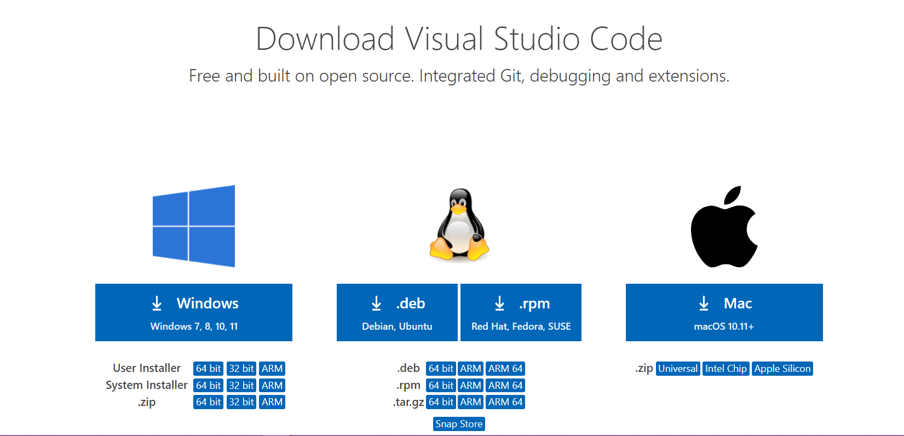
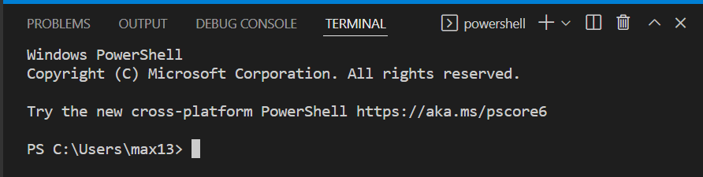
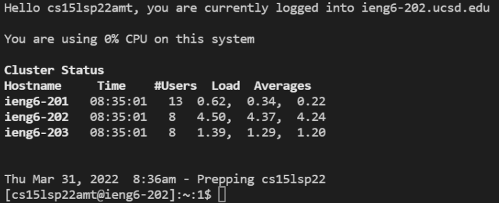
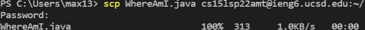
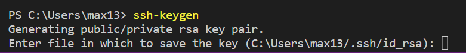
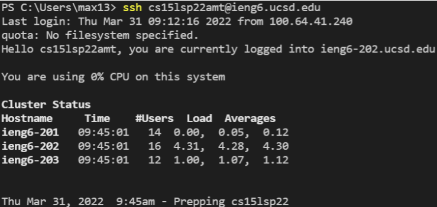

## Dowload VScode
[Download here](https://code.visualstudio.com/Download)

* Make sure to download the correct installer for your operating system

## Remote Access
To remotely connect to the ieng6 computer, (For Windows) install [Open SSH](https://docs.microsoft.com/en-us/windows-server/administration/openssh/openssh_install_firstuse), you will need to enter this command `ssh cs15lsp22<username>@ieng6.ucsd.edu)` into the VScode terminal , where you replace the `<username>` with the letters in your course-specific account(next tutorial will help you find it).
After entering that command, you will need to enter yes to continue connecting and then enter your password(next tutorial will help you find it).
* Look up your username(school email) and password for ieng6 computer: [https://sdacs.ucsd.edu/~icc/index.php](https://sdacs.ucsd.edu/~icc/index.php)
* Set your password with this [tutorial](https://cdn-uploads.piazza.com/paste/ktv2gnof3sx5bf/181c3cb053df5cf1ccaf0457f56f12a2e5aa90b139aef8c2ea8fcc590f02fadf/How-to-Reset-your-Password.pdf)
* If the log in was successful, you should see this: 

## Useful Commands
* `exit` or `Ctrl-D` to log out
* `pwd` to check current directory
* `cd <directory>` to change directory, `cd ~` will change to homepage, `cd ..` will go to the previous directory
* `cp <file dirctory> <file directory>` to copy a file to a directory, the second directory can be another file to override the second file with the first file
* `cat <file directory>` to check the content of a file
* `ls` to list the files in your current directory

## Secure Copy
To copy a file from your computer to the remote computer, use the command `scp <file directory> cs15lsp22<username>@ieng6.ucsd.edu`
* Remember to log out of the remote computer before using this command
* If it worked, it will ask you to log in to your account and asks for your password
* Once the copying process is finished: , you can log out to copy another file

## SSH Key
To speed up the process of accessing the remote computer, you can set up a SSH key to eliminate the need of entering password.
On your computer(log out of remote), use the command `ssh-keygen`.
Use the same file directory they give you in the parenthesis: .
Do not add a passphrase, leave blank and press enter.
Save the address for your public key.
(For Windows) follow this [tutorial](https://docs.microsoft.com/en-us/windows-server/administration/openssh/openssh_keymanagement#user-key-generation) for `ssh-add`.
This creates both a private key and a public key.
You need to copy the public key to your user account on the remote computer.
Log in to your account, make the directory .ssh with `mkdir.ssh`
Log out of your account, use `scp <the directory of your public key> cs15lsp22<username>@ieng6.ucsd.edu:~/.ssh/authorized_keys`
* Try logging in again, you won't need to enter your password: 
* Same works for `scp` command

# # Optimization
To further optimize remote running(secure copying a file), you can combine commands into one line that you can copy everytime you want to copy a file to the remote computer.
* `ssh` command has one more argument that you can add to perform that action on your remote computer.
* You can use `;` to add multiple commands into one line.
* This command `scp <java file> cs15lsp22<username>@ieng6.ucsd.edu:<destination directory>; ssh cs15lsp22<username>@ieng6.usd.edu "javac <java file>; java <java file name>"` will copy a java file from your computer to the remote computer and compile and run it then logs you out. 
