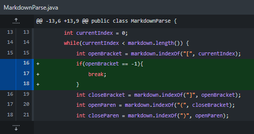
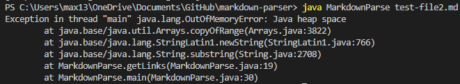
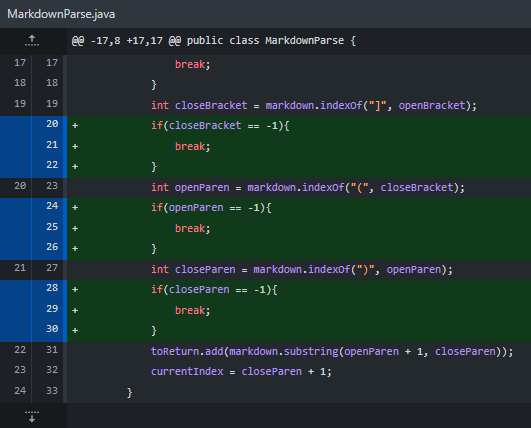
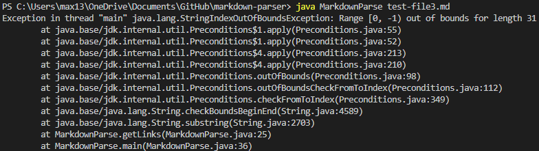
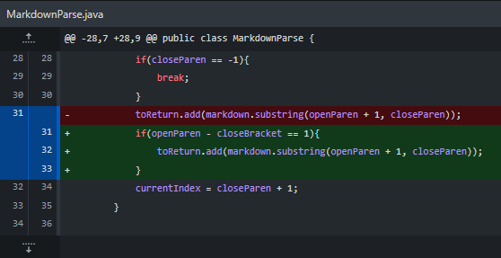
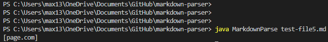

## Change One
* Code change:
  * 
* Test file:
  * [test-file2.md](https://github.com/shootingdarts/markdown-parser/blob/main/test-file2.md)
* Symptom:
  * OutofMemoryError: 
* Explanation: After finding the last link in test-file2, the currentIndex does not reach the end of the file, due to the extra lines at the end. This causes the while loop to find another set of link. OpenBracket will find nothing and return -1 then the other three indexOf starting at index -1 is the same as starting at index 0, meaning that the while will become an infinite loop thus causing the OutOfMemoryError.

## Change Two
* Code change:
  * 
* Test file:
  * [test-file3.md](https://github.com/shootingdarts/markdown-parser/blob/main/test-file3.md)
* Symptom:
  * IndexOutOfBoundsException: 
* Explanation: Since there are no parentheses in test-file3, the find parentheses indexOf will return 0 thus causing the substring method to find from index 0 to -1 leading to the IndexOutOfBoundsException.

## Change Three
* Code change:
  * 
* Test file:
  * [test-file5.md](https://github.com/shootingdarts/markdown-parser/blob/main/test-file5.md)
* Symptom:
  * Actual result differ from expected: 
* Explanation: In test-file5, there are all four components for a link, however, they are formatted for images with the exclaimation mark before the open bracket. The four index finders will work properly, so the substring will add the string inside of the parentheses since there are no filters to distinguish images from links.
