## My Implementation
* [Repository](https://github.com/shootingdarts/markdown-parser)
### Snippet_1
* Expected: ```[`google.com, google.com, ucsd.edu]```
* Test: 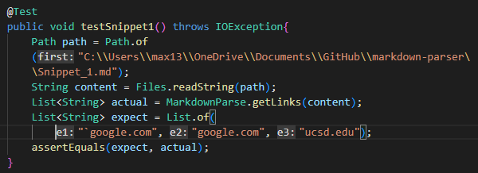
* Result:
  * Failed: 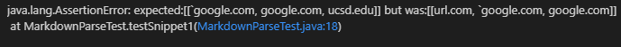
* Fix: Remove any content within two backticks if they are before an open parenthesis. Then the program will look for any link formats. Only the contents in backticks before open parentheses are removed, because if it is a link then the link format will override the backticks and the backtick would be part of the link.

### Snippet_2
* Expected: ```[a.com, a.com(()), example.com]```
* Test: 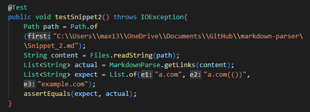
* Result:
  * Failed: 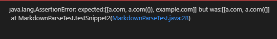
* Fix: For the nested parentheses, it will involve the addition of a helper method to check for pairs of parentheses or brackets and output the last close parenthesis/bracket. Whenever an open parenthesis is found, call the helper method and if the rest of the String follows the link format then all the entire link as output. The same method would be called for nested brackets, and the program would ignore all the nested brackets inside the outermost bracket. To fix the escaped backets, an easy fix is to make the program ignore any brackets that has a `\` before it.

### Snippet_3
* Expected: ```[https://sites.google.com/eng.ucsd.edu/cse-15l-spring-2022/schedule]```
* Test: 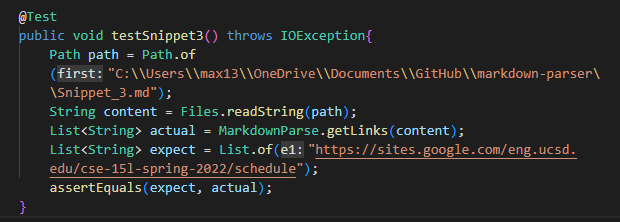
* Result:
  * Failed: 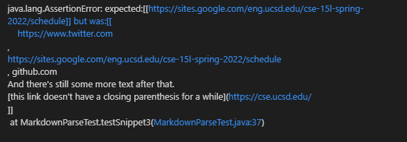
* Fix: For the newlines in brackets and parentheses, an easy fix is for the program to check if the content inside the brackets and parentheses contains any `\n`. If either one contains `\n` then do not add the link.

## Other Implementation
* [Repository](https://github.com/BellaReal/markdown-parser)
### Snippet_1
* Expected: ```[`google.com, google.com, ucsd.edu]```
* Test: 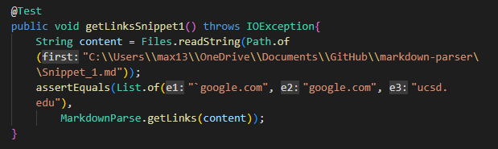
* Result:
  * Failed: 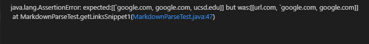

### Snippet_2
* Expected: ```[a.com, a.com(()), example.com]```
* Test: 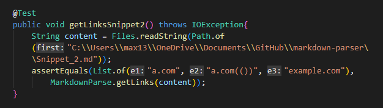
* Result:
  * Failed: 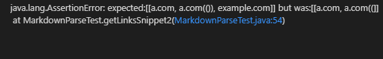

### Snippet_3
* Expected: ```[https://sites.google.com/eng.ucsd.edu/cse-15l-spring-2022/schedule]```
* Test: 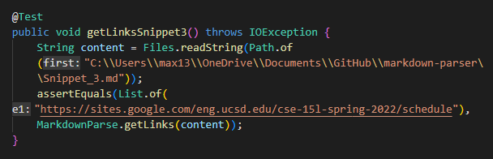
* Result:
  * Failed: 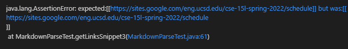
