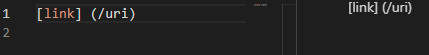
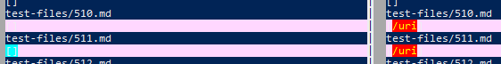
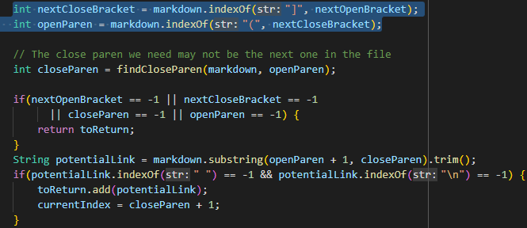

## Test File 573
* [573.md](https://github.com/shootingdarts/cse15lsp22-markdown-parser/edit/main/test-files/573.md)
### Expected Output
* `[]`
*  
### Actual Ouputs
* `vimdiff`: 
  * The file name is above the output.
* Left: `[]` Right: `[/url]`
  * The left is an implementation from my group, right is lab 9 implementation.
  * My group's implementation is correct, the lab 9 implementation is wrong.
  * The lab 9 implementation did not check for the image format. The "link" added is an image, because it had the `!` before the `[`.
    * 
    * When checking if it is potentially a link, the if statement should also include `markdown.charAt(nextOpenBracket - 1) != '!'`.

## Test File 510
* [510.md](https://github.com/shootingdarts/cse15lsp22-markdown-parser/edit/main/test-files/510.md)
### Expected Output
* `[]`
* 
### Actual Outputs
* `vimdiff`: 
  * The file name is above the output.
* Left: `[]` Right: `[/uri]`
  * The left is an implementation from my group, right is lab 9 implementation.
  * My group's implementation is correct, the lab 9 implementation is wrong.
  * The lab 9 implementation did not check if the `]` and `(` are connected for the link format to be valid. Since the program did not check for that, it counted that that link format as valid.
    * 
    * After getting the index of the `]` and `(`, create a boolean variable, like `validFormat`, to store true. Then create an if statement that checks if the difference between them is > 1, if true, then set the boolean value to be false. Then add another condition to the last if else statement in the image, where if `validFormat` is true proceed to add that link to the list. 
