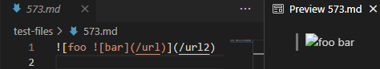
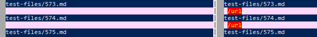
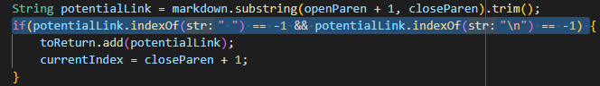
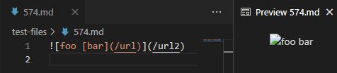

## Test File 573
* [573.md](https://github.com/shootingdarts/cse15lsp22-markdown-parser/edit/main/test-files/573.md)
### Expected Output
* `[]`
*  
### Actual Ouputs
* `vimdiff`: 
* Left: `[]` Right: `[/url]`
  * The left is an implementation from my group, right is lab 9 implementation.
  * My group's implementation is correct, the lab 9 implementation is wrong.
  * The lab 9 implementation did not check for the image format. The "link" added is an image, because it had the `!` before the `[`.
    * 
    * When checking if it is potentially a link, the if statement should also include `markdown.charAt(nextOpenBracket - 1) != '!'`.

## Test File 574
* [574.md](https://github.com/shootingdarts/cse15lsp22-markdown-parser/edit/main/test-files/574.md)
### Expected Output
* `[]`
* 
### Actual Outputs
* `vimdiff`: 
* Left: `[]` Right: `[/url]`
  * The left is an implementation from my group, right is lab 9 implementation.
  * My group's implementation is correct, the lab 9 implementation is wrong.
  * Even though the implementation selected the wrong content between the brackets, selected `[foo [bar]` instead of `[foo [bar](/url)]` , the bug would still be fixed if the program just checked for the `!` before the first `[`. If the program filtered this link out, there won't be another open bracket after the closing parenthesis, `](/url2)`. Therefore, the program would produce the expected output despite selecting the wrong bracket combination.
    * 
    * When checking if it is potentially a link, the if statement should also include `markdown.charAt(nextOpenBracket - 1) != '!'`.
